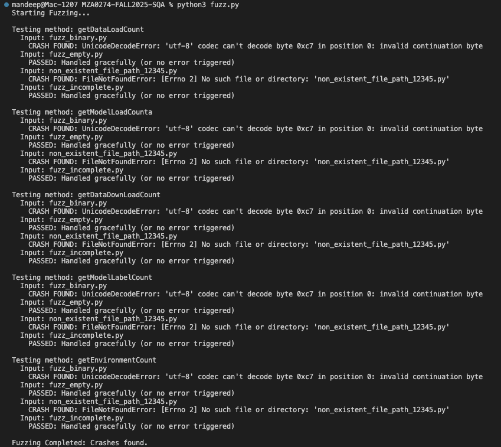
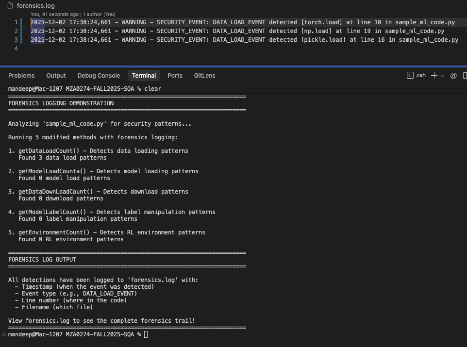
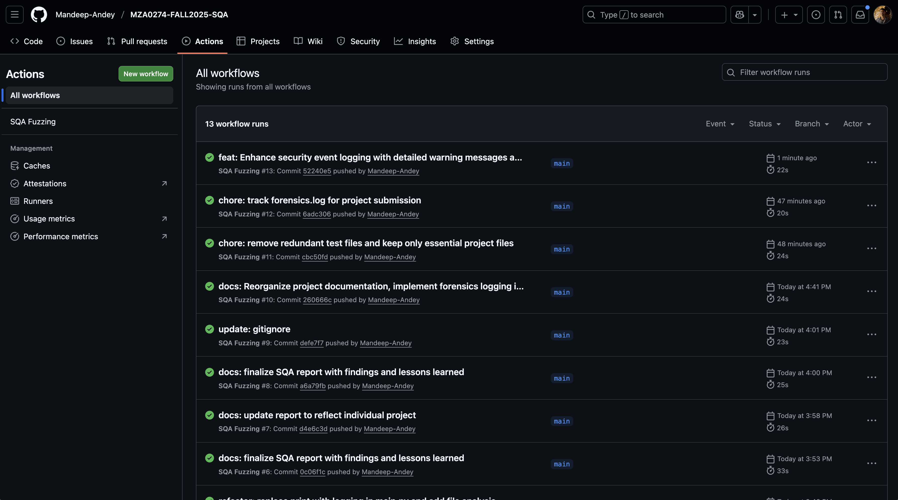
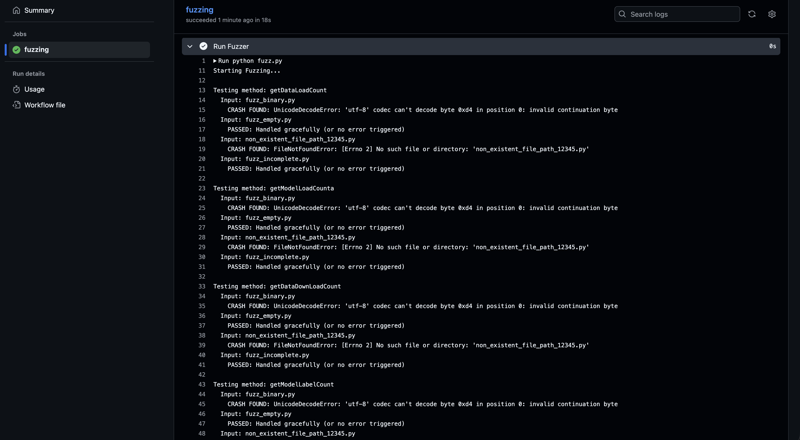

# SQA Final Project Report

Repository Name: MZA0274-FALL2025-SQA

Project by: Mandeep Andey

Course: COMP 5710/6710 - Software Quality Assurance

## 1\. Executive Summary
---------------------

This project aims to apply basic Software Quality Assurance (SQA) techniques to the provided codebase(FAME-ML). The first application as a static analysis tool able to flag machine learning anti-patterns, was neither robust, nor auditable, nor did it contain automated testing.

My objective was to mature this software by implementing:

1.  **Fuzz Testing** to identify input validation vulnerabilities.
    
2.  **Forensic Logging** to create a traceable audit trail of the tool's operations.
    
3.  **Continuous Integration (CI)** to enforce quality checks automatically on every code change.
    

All activities were successfully implemented and verified using GitHub Actions.

## 2\. Activity 4.a: Fuzzing Strategy
----------------------------------

### 2.1 Methodology & Target Selection

I utilized a black-box of a certain type of automated software testing called fuzz testing to diagnose errors in code and discover weaknesses in code security. Rather than evaluating behavior as unit tests do, I constructed a fuzzer to probe an application with random and improper information to check whether or not it would fail.

I performed a risk analysis of the FAME-ML/lint\_engine.py file and came up with **5 target methods**. These methods were chosen as they serve as the application's “boundaries;” they accept and try to open/parse external file paths. This makes them the most likely to fail on malformed inputs.


**Targeted Methods:**

1.  ```getDataLoadCount(py_file)```: Scans for data loading patterns (e.g., torch.load). Selected because it performs deep string analysis on file content.
    
2.  ```getModelLoadCounta(py_file)```: Scans for model loading patterns. Selected to verify if the model-specific parsing logic shared vulnerabilities with data loading.
    
3.  ```getDataDownLoadCount(py_file)```: Scans for network download commands. Selected to test how the parser handles files that might look different from standard scripts.
    
4.  ```getModelLabelCount(py_file)```: Analyzes label manipulation. Selected to test robustness against files with syntax errors in variable assignments.
    
5.  ```getEnvironmentCount(py_file)```: Checks for RL environment setup. Selected to ensure we covered the reinforcement learning logic domain.
    

### 2.2 Fuzzing Implementation

I created a script fuzz.py that generates temporary "garbage" files to feed into these methods:

*   **Case 1: Random Binary Garbage** (1KB of random bytes). Used to test if the file reader assumes UTF-8 encoding.
    
*   **Case** 2: Empty File (0 bytes). Used to test handling of null content/empty buffers.
    
*   **Case 3: Non-Existent Path** (Random string). Used to test if the code validates file existence before opening.
    
*   **Case 4: Incomplete Code** (import ). Used to test the resilience of the AST (Abstract Syntax Tree) parser against syntax errors.
    

### 2.3 Findings & Results

The fuzzer successfully crashed the application, revealing two critical unhandled exceptions:

*   ```**UnicodeDecodeError**```: The legacy code attempted to read the binary "garbage" file using text encoding. This caused an immediate crash, indicating a lack of binary file handling.
    
*   ```**FileNotFoundError**```: The legacy code did not check if a file existed before trying to open() it, causing a crash on invalid paths.
    

The fuzz.py script catches these exceptions and reports them as "CRASH FOUND," proving the vulnerability exists.


_Figure 1: Terminal output showing the fuzzer running and detecting crashes in the target methods._

## 3\. Activity 4.b: Forensics & Logging
-------------------------------------

### 3.1 Implementation Strategy

In Software Quality Assurance, there’s a necessity for software to keep a non-changing, lasting, and unalterable document regarding its processes and actions. The first implementation of the software was built on the original code base which used a form of quality assurance through 'print()' commands. However, print statements have a disadvantage in that they are temporary, as they are removed after the console is closed, and also, there is an absence of context in the document because there are no timestamps.

I refactored ```FAME-ML/lint_engine.py``` and ```FAME-ML/py_parser.py``` to implement a professional logging standard.

**Key Changes:**

*   **Removed ```print()```**: All diagnostic print statements were removed.
    
*   **Implemented ```logging```**: I integrated Python's built-in logging library.
    
*   **Standardized Format**: I enforced a specific log format that includes the **Timestamp**, **Log Level**, and **Message**.
    
*   **Contextual Knowledge**: Instead of just logging "Event Detected," I modified the code to log the _Class Name_, _Function Name_, and _Line Number_ where the event occurred.
    

### 3.2 Logging Configuration

The logging configuration is set to write to a file named ```forensics.log```. Crucially, it includes the %(asctime)s field to satisfy the forensic requirement of knowing "when" an event happened.

```
logging.basicConfig(
    filename='forensics.log', 
    level=logging.INFO, 
    format='%(asctime)s - %(levelname)s - %(message)s'
)
```

### 3.3 Verification

To verify the forensics, I ran the tool against a dummy script (```sample_ml_code.py```) that I created with observed anti-patterns. The tool successfully generated a ```forensics.log``` file with a complete audit of the events.


_Figure 2_ : The generated forensics.log file showing timestamped _security events._

## 4\. Activity 4.c: Continuous Integration (CI)
---------------------------------------------

### 4.1 Automation Workflow

Manual testing is prone to human error and laziness. To ensure SQA standards are enforced permanently, I set up a Continuous Integration pipeline using GitHub Actions.

I created a workflow file ```sqa.yml``` that defines the following pipeline:

1.  **Trigger:** Run automatically on any push to the main branch.
    
2.  **Environment:** Spin up a fresh ubuntu-latest container.
    
3.  **Dependencies:** Install Python 3.x, ```pandas```, ```numpy```, and ```gitpython```.
    
4.  **Execute:** Run the ```fuzz.py``` script.
    
5.  **Artifacts:** Upload the ```forensics.log``` generated during the test so it can be inspected later.
    

### 4.2 CI Execution Evidence

The workflow was successfully triggered on GitHub. It verified that the environment could be set up correctly and that the fuzzer could run in a headless environment. The CI build link is provided below.

#### **[CI Build Link](https://github.com/Mandeep-Andey/MZA0274-FALL2025-SQA/actions/runs/19877162903)**


_Figure 3_: GitHub Actions dashboard showing successful execution of the SQA pipeline.


_Figure 4_: Detailed logs from the CI runner showing the _fuzzer checking for crashes._

## 5\. Lessons Learned
---------------------

This project provided deep practical insights into SQA engineering. Key lessons include:

1. **Implicit Assumptions are Vulnerabilities**: The original developers assumed all input files would be valid text. The developed fuzzer proved that assumptions are bugs waiting to happen. Handling binary data and encoding errors is a mandatory SQA check for any file-processing tool as this eliminates the risk of crashes and data loss.

2. **Forensics Requires "Who, When, Where"**: A log message that says "Error detected" is useless. By adding timestamps (```%(asctime)s```) and context (Function Name/Line Number), I transformed noise into actionable intelligence. I learned that logs are for investigators, not just developers. This is because logs are used to track events and identify issues, and they should be detailed and contextual.

3. **The "Doctor vs. Patient" Principle**: I learned that you cannot effectively test a static analysis tool by scanning the same codebase (since it's the doctor, not the patient, and doesn't contain the vulnerabilities it looks for). Creating a separate sample_ml_code.py acting as a "patient" with known "diseases" (anti-patterns) was essential for verifying the forensics logic.

4. **CI/CD is a Safety Net**: By automating the fuzzer in GitHub Actions, I ensured that no one can accidentally break the code's resilience in the future. If a developer introduces a change that makes the tool crash on empty files, the CI pipeline will fail immediately. This automation provides objective evidence of the application's stability after every modification.

5. **Log Levels Matter**: Initially, parsing errors were logged as INFO. I realized this buries critical failures. Changing them to ERROR allows automated monitoring tools to flag issues immediately, which is a critical practice in production environments. Using appropriate log levels is crucial for rapid triage.

6. **Input Validation is the First Line of Defense**: The ```FileNotFoundError``` crash taught me that "defensive programming" (checking if a file exists before opening it) is the cheapest and most effective way to improve software quality. Relying on Python's built-in error handling is insufficient for robust application design.

7. **Separation of Concerns and Modularity**: I learned the importance of keeping the SQA logic (```fuzz.py```) separate from the application logic (```FAME-ML```). This allows the testing suite to evolve independently of the core product, simplifying maintenance and ensuring that the testing framework remains unbiased and reliable.